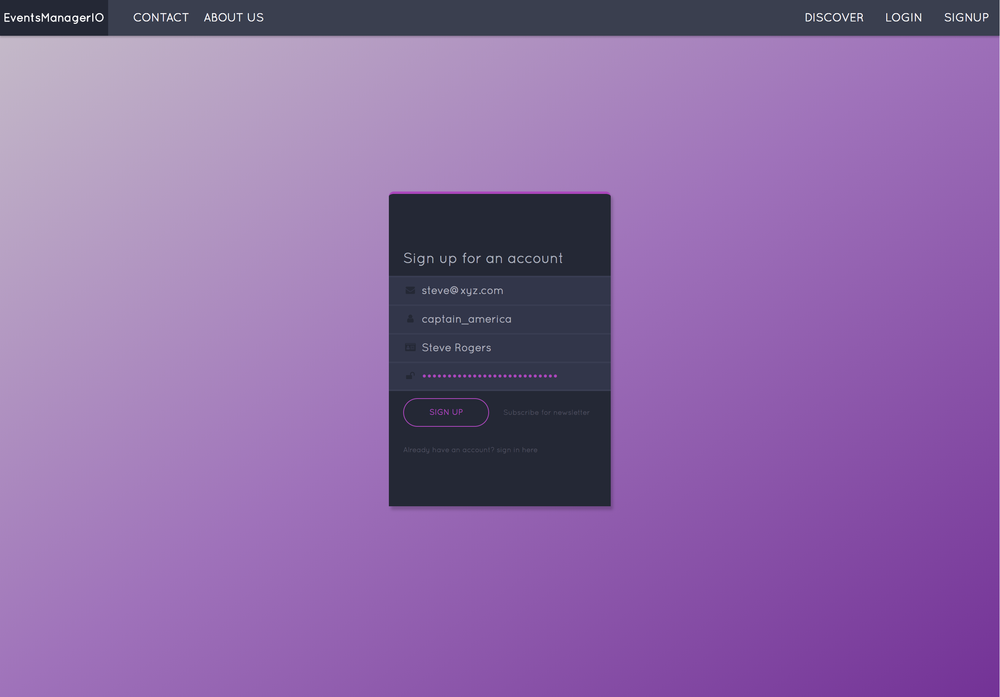

# EventsManagerIO

[](https://travis-ci.org/appcypher/events-manager-io)
[](https://coveralls.io/github/AppCypher/EventsManager?branch=ch-continuous-integration-153009907 "coveralls")
[](https://codeclimate.com/github/AppCypher/EventsManager/maintainability)
[](https://codeclimate.com/github/AppCypher/EventsManager/test_coverage)
[](https://codecov.io/gh/appcypher/events-manager-io)
[](https://swaggerhub.com/apis/appcypher/EventsManager/1.0.0)

[](https://opensource.org/licenses/Apache-2.0)



A simple site for managing event-centers and scheduling events.

**See EventsManagerIO running [here](http://events-manager-io.herokuapp.com/).**

## Made With
  ### Client
    * Bootstrap4 for UI styling
    * React for managing UI states
    * Redux for flux-like app development
    * SASS for custom styling
    * Webpack & Uglifyjs for bundling and load-time optimization

  ### Server
    * Nodejs for server-side logic
    * Express for api routes implementation
    * Json Web Tokens for session authentication
    * Postgresql & Sequelize for database management
    * Heroku for hosting services

  ### Continuous Integration
    * Travis CI & Codeclimate for test automation
    * Coveralls for test coverage report
    * Hounds CI for linting report

  ### Test-Driven Development
    * Mocha & Chai for api route testing
    * Jest & Enzyme for UI testing
    * Nightwatch & Selenium for end-to-end testing


## Installation.
  * Install [Nodejs](https://nodejs.org/en/download/) and [Postgres SQL](https://www.postgresql.org/download/)
  * Clone this repo ```git clone https://github.com/appcypher/event-manager-io.git```
  * Run ```npm install``` to install the required dependencies
  * Run ```npm test``` to fireup the tests
  * Navigate to http://localhost:3000/


## Available Task Runners
  ### Production
    * start → required for starting the server on Heroku; transpiles project and runs it from output folder

  ### Development
    * server →  transpiles the project on the fly and runs the server
    * server:watch → watches for file changes, transpiles them and runs the server
    * webpack:watch → watches and bundles react project on the fly
    * build:client:dev → sets NODE_ENV to development and builds react project using client.dev.js config file
    * build:client:prod → sets NODE_ENV to production and builds react project using client.prod.js config file
    * build:client:dev:watch → sets NODE_ENV to development and watches and bundles react project
    * build:client:prod:watch → sets NODE_ENV to production and watches and bundles react project
    * lint → runs the linter on .js and .jsx files
    * sass:watch → watches the scss folder and transpiles the scss files to css on the fly

  ### Test
  * test → sets NODE_ENV to test runs all tests "npm run test:api & npm run test:react",
  * test:api → demigrates and remigrates test database; sets NODE_ENV to test; runs tests related to api endpoints; and creates a test report
  * test:e2e → sets NODE_ENV to test and runs end-to-end unit tests
      * You need to download [JDK](http://www.oracle.com/technetwork/java/javase/downloads/index.html), [Selenium Server 3.9.1](http://selenium-release.storage.googleapis.com/index.html) and [Chrome driver 2.40](https://sites.google.com/a/chromium.org/chromedriver) for your system
      * The Selenium and Chrome driver executables need to be copied into the `bin/` folder
  * test:client → sets NODE_ENV to test and runs react tests
  * test:api:migrate → sets NODE_ENV to test and migrates test database
  * test:api:demigrate → sets NODE_ENV to test and demigrates test database

## Available APIs
- API routes for users to create accounts and login to the application
  * POST : ```/api/v1/users```  (username, fullname, password, email)
  * POST : ```/api/v1/users/login``` (username, password)

- An API route for logging out user
  * POST : ```/api/v1/users/logout```

- An API route that allow users to add new event
  * POST : ```/api/v1/events```

- An API route that allow users to modify an event
  * PUT : ```/api/v1/events/<eventId>```

- An API route that allow users to delete an event
  * DELETE : ```/api/v1/events/<eventId>```

- An API route that allow users to gets all available event centers
  * GET : ```/api/v1/centers```

- An API route that allow users to gets more details on a particualar event center
  * GET : ```/api/v1/centers/<centerId>```

- An API route that allow admin users to add new event centers
  * POST : ```/api/v1/centers```

- An API route that allow admin users to modify existing event centers
  * PUT : ```/api/v1/centers```


Check [here](https://swaggerhub.com/apis/appcypher/EventsManager/1.0.0) for full documentation.

## License
[Apache License 2.0](https://github.com/appcypher/event-manager-io/blob/master/LICENSE)
